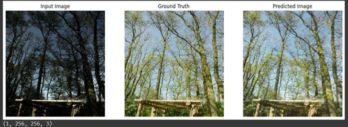

# Low-Light-Image-Enhancement

### **Goal of the project:**
To transform low-light images to enhanced/enlightened images using GAN

The images that are captured in low-light conditions, suffer from very poor visibility caused by low contrast, color distortion and significant measurement noise. Our objective is to improve the visibility of low-light images using a deep learning-based method (conditional Generative Adversarial Networks or cGANs).
The basic idea is to train a neural network to generate the illuminated and enhanced version of the low-light image.

### Dataset used
● Low Light paired dataset (LOL): [Google Drive](https://drive.google.com/open?id=157bjO1_cFuSd0HWDUuAmcHRJDVyWpOxB), [Baidu Pan (Code:acp3)](https://pan.baidu.com/s/1ABMrDjBTeHIJGlOFIeP1IQ)

● Synthetic Image Pairs from Raw Images: [Google Drive](https://drive.google.com/open?id=1G6fi9Kiu7CDnW2Sh7UQ5ikvScRv8Q14F), [Baidu Pan](https://pan.baidu.com/s/1drsMAkRMlwd9vObAM_9Iog)

We combined two datasets named LOL Dataset (500 images) and Synthetic Image Pairs from Raw Images dataset (1000 images). 
Total of 1450 images were used for training the model and 50 images for test predictions.
Image Resolution - 256 x 256.
We use concatenated images (Lowlight image + Ground Truth) for training network with resolution 256x512.

#### Sample input images with groundtruth

#### Generator Network - modified UNet
#### Discriminator Network - modified PatchGAN

### Model Training

#### Fine Tuning hyper-parameters during training

### Model Prediction

### Flask Application deployed on AWS EC2 instance

